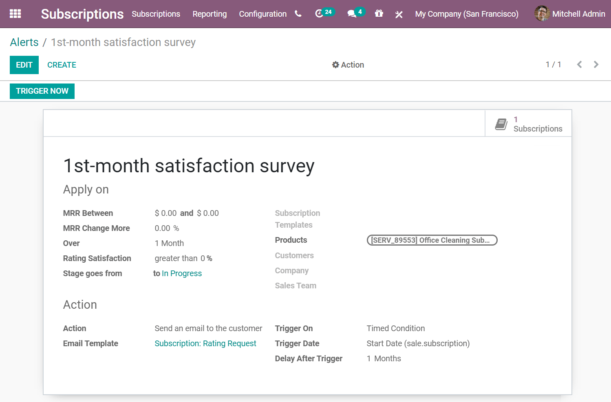

=======================
Set up automatic alerts
=======================

Now that our subscriptions are up and running, you want to stay up-to-date with your customers.
Some automation would be appreciated since you wouldn't want to go through the list of all your
subscribers to check how things are going. This is what the *Automatic alerts* feature is for.

For example, when customers subscribe to your magazine, you probably want to send them an email to
welcome them and express your gratitude. Or, if the satisfaction rate of your customers drops below
50%, you probably want to schedule a call with them to understand the reasons for their
dissatisfaction.

With **Odoo Subscriptions**, you can automatically send an email to your customers to welcome them,
you can also create a "Call" task for one of your salespeople so that he/she can try to understand
your customer's dissatisfaction and finally, why not automatically send satisfaction surveys by
email after a month to evaluate your services? All of that is possible with our amazing application!

Create a new automatic alert
============================

In this example, it is shown how to configure Odoo to automatically send satisfaction surveys by
email after one month of subscription by creating a new alert in **Odoo Subscriptions**.

Go to :menuselection:`Subscriptions --> Configuration --> Alerts`. From there, you can create a new
alert. The first thing you need to add is a name. Then, you can choose what to apply this to.
Indeed, you can apply this alert on a subscription template, on a specific customer or even on a
specific product. If you want to add more specifications, you can also specify the value of your
MRR, the change rate of your MRR over a certain period of time, the value of the satisfaction rate
and even, the stage to which you want to apply this alert.

For the action section, you can specify your *Action* and your *Trigger on*. If the *Trigger on* is
equal to *Modification*, that means the action is triggered every time there is a change or anything
added to the subscription and that all the conditions in the *Apply on* section are met. Now, if the
*Trigger on* is set on *Timed condition*, it means that the action is triggered based on the type of
trigger date. In this example, the *Trigger date** is the start date and the delay after the trigger
date is one month. After that, you can choose your action. You have the choice between
*Create next activity*, *Set a tag on the subscription*, *Set a stage on the subscription*,
*Mark as To renew*, *Send an email to the customer* and *Send an SMS Text Message to the customer*.
In this example, if you choose the *Send an email to the customer* option, you can precise the
*Email template* you want to use. This will send a rating survey to assess the experience after one
month only to the customers who have purchased the Office Cleaning monthly subscription.

Modify an existing automatic alert
==================================

By default, Odoo suggests you an already existing automatic alert called
*Take action on less satisfied clients*. The alert is applied to the rating satisfaction of your
customers and the action is triggered on *Timed condition*. If their satisfaction is less than 30%,
a salesperson will have to call them. This action is automatically assigned to the salesperson who
manages the subscription and the due date is 5 days after the triggering of this action.

This feature ensures that your clients are happy and that you are taking actions if they are not.
It keeps your customer retention very high.